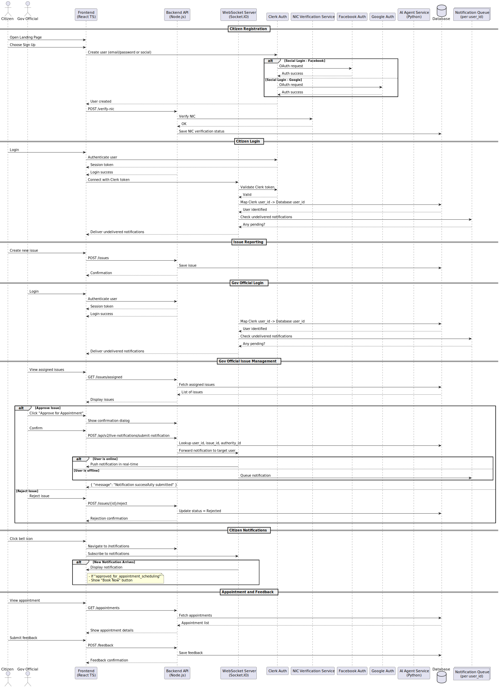

# 🏛 GovPulse - Intelligent Government Issue Management Platform

**GovPulse** is a comprehensive solution designed to enhance government efficiency in Sri Lanka by providing transparency, accountability, and intelligent prioritization of public issues. The platform leverages advanced AI technology to create a fair and logical system for addressing long-standing government issues that have been overlooked or covered up.

## 🎯 Project Vision

GovPulse addresses the critical problem of unresolved government issues in Sri Lanka that have persisted due to bureaucratic inefficiencies, lack of transparency, and officials prioritizing job security over public service. Our platform creates a transparent, AI-driven system that ensures issues receive proper attention based on their urgency, societal impact, and criticality.

## 🌟 Key Features

### 🔍 **Issue Transparency & Visibility**

- Provides visibility to issues that unethical government officials have attempted to cover up
- Creates an open platform where citizens can report and track government-related problems
- Ensures accountability at all levels of government hierarchy

### 📊 **Intelligent Issue Ranking System**

- **AI-Powered Prioritization**: Advanced AI algorithms analyze multiple parameters to rank issues
- **Multi-Factor Analysis**: Considers date reported, region, government sector, upvotes, and metadata
- **Fair Allocation**: Ensures the most critical issues receive attention first
- **Dynamic Scoring**: Real-time ranking updates based on new data and community feedback

### 👥 **Community-Driven Upvoting**

- Reddit-style upvoting system adapted for government issue management
- Community validation of issue importance and urgency
- Democratic approach to issue prioritization
- Prevents manipulation through intelligent duplicate detection

### 🤖 **AI-Powered Chatbot Assistant**

- **Multilingual Support**: Understands and processes details in Sinhala and English
- **Automatic Form Filling**: Extracts relevant details from spoken or written input
- **Smart Categorization**: Automatically categorizes issues by government sector
- **Voice Recognition**: Supports voice input for accessibility
- **Information Querying**: Can answer user questions about the configured Government sectors.

### 🔄 **Duplicate Issue Prevention**

- Advanced AI algorithms detect duplicate issues beyond simple word matching
- Considers location, sector, issue type, and other metadata for duplicate detection
- Consolidates similar issues to prevent fragmentation
- Maintains data integrity and prevents spam

### 📅 **Smart Appointment Booking**

- Automated appointment scheduling with relevant government officials
- Smart time slot selection that works for both citizens and officials
- Integration with government official calendars
- Automated reminders and notifications

### 📈 **Government Official Dashboard**

- Comprehensive statistics and analytics for government officials
- AI-powered query answering system for reported issues
- Performance tracking and issue resolution metrics
- Data-driven insights for better decision making

### 📝 **AI Document Generation** (Future Feature)

- Automated generation of government-standard documents
- AI-assisted drafting for issue resolution
- Template-based document creation
- Compliance with government formatting standards

## 🏗 System Architecture

*System architecture diagram showing the multi-layered structure of GovPulse with React frontend, Node.js backend, and Python AI service components working together through A2A protocol*

GovPulse/
├── frontend/                    # React TypeScript Frontend
│   ├── src/
│   │   ├── components/         # UI Components
│   │   ├── pages/             # Application Pages
│   │   ├── services/          # API Services
│   │   └── utils/             # Utility Functions
│   ├── public/                # Static Assets
│   └── package.json           # Frontend Dependencies
│
├── backend/                    # Node.js Backend API
│   ├── src/
│   │   ├── routes/            # API Routes
│   │   ├── controllers/       # Business Logic
│   │   ├── models/            # Data Models
│   │   ├── middleware/        # Authentication & Validation
│   │   └── services/          # External Service Integrations
│   └── package.json           # Backend Dependencies
│
├── agent/                      # Python AI Service (A2A Protocol)
│   ├── backend/
│   │   ├── host/              # Central Host Agent
│   │   ├── agents/            # Specialized AI Agents
│   │   │   ├── ceb/           # Electricity Board Agent
│   │   │   └── health/        # Health Ministry Agent
│   │   ├── api/               # External API Integrations
│   │   └── common/            # Shared Infrastructure
│   └── requirements.txt       # Python Dependencies
│
└── main.py                     # Application Entry Point

##   Database Schema & ER Diagram

The GovPulse platform uses a comprehensive database schema designed to handle complex government issue management workflows. The Entity-Relationship diagram below illustrates the relationships between different entities in the system:

*Entity-Relationship diagram showing the database structure and relationships between users, issues, appointments, officials, and other core entities in the GovPulse system*

### Key Database Entities:

- **Users**: Citizens, government officials, and administrators
- **Issues**: Reported problems with metadata, location, and categorization
- **Appointments**: Scheduled meetings between citizens and officials
- **Officials**: Government personnel with department assignments
- **Upvotes**: Community-driven issue prioritization system
- **TimeSlots**: Available appointment scheduling windows
- **Government Sectors**: Organizational structure for issue categorization

## 🔄 System Flow & Sequence Diagrams

The following sequence diagrams illustrate the key workflows and interactions within the GovPulse platform, showing how different components communicate and process user requests:

*Sequence diagrams showing the flow of operations including issue reporting, AI processing, appointment booking, and inter-service communication patterns in the GovPulse ecosystem*

##  🛠 Technology Stack

### **Frontend**

- **React 19.1.0** with TypeScript
- **Vite** for fast development and building
- **TailwindCSS** for modern UI styling
- **ESLint** for code quality

### **Backend (Node.js)**

- **Node.js** with Express.js/Fastify
- **RESTful APIs** for client communication
- **Authentication & Authorization** middleware
- **Database Integration** (PostgreSQL/MongoDB)

### **AI Service (Python)**

- **LangGraph** for agent workflow orchestration
- **LangChain** for AI model integration
- **OpenAI GPT-4** for natural language processing
- **Google ADK** for advanced AI capabilities
- **Perplexity AI** for real-time information retrieval
- **Agent-to-Agent Protocol (A2A)** for service communication

### **External Integrations**

- **Voice Recognition APIs** for Sinhala language support
- **Government API Integrations** for official data
- **Notification Services** for real-time updates
- **Calendar Integration** for appointment scheduling

## 🚀 Getting Started

### Prerequisites

- **Node.js** 18+ and npm/yarn
- **Python** 3.10+
- **Git** for version control

### 1. Clone Repository

bash
git clone https://github.com/RMCV-Rajapaksha/GovPulse.git
cd GovPulse

### 2. Frontend Setup

bash
cd frontend
npm install
npm run dev

Frontend will be available at `http://localhost:5173`

### 3. Backend Setup

bash
cd backend
npm install
npm run dev

Backend API will be available at `http://localhost:3000`

### 4. AI Service Setup

bash
cd agent
python -m venv venv
source venv/bin/activate  # On Windows: venv\Scripts\activate
pip install -r requirements.txt

# Create .env file with your API keys
OPEN_API_KEY=your_openai_api_key
GOOGLE_API_KEY=your_google_api_key
PERPLEXITY_API_KEY=your_perplexity_api_key

# Start AI agents
cd backend/agents/ceb && python server.py    # Port 10010
cd backend/agents/health && python server.py # Port 10011
cd backend/host && python server.py          # Port 11000

### 5. Environment Configuration

Create environment files for each service:

**Frontend (.env)**

env
VITE_API_URL=http://localhost:3000
VITE_AI_SERVICE_URL=http://localhost:11000

**Backend (.env)**

env
NODE_ENV=development
PORT=3000
DATABASE_URL=your_database_connection_string
JWT_SECRET=your_jwt_secret
AI_SERVICE_URL=http://localhost:11000

## 💡 Usage Examples

### **Reporting an Issue**

1. **Voice Input**: "මගේ ප්‍රදේශයේ මාර්ගය කැඩී ගොස් ඇත" (The road in my area is damaged)
2. **AI Processing**: Chatbot extracts location, issue type, and severity
3. **Auto-Categorization**: System categorizes under "Infrastructure - Roads"
4. **Form Generation**: Automatically fills issue report form
5. **Verification**: User reviews and submits after verification

### **Issue Ranking Process**

1. **Parameter Analysis**: AI considers all relevant factors
2. **Community Input**: Upvoting influences priority score
3. **Real-time Updates**: Ranking adjusts based on new information
4. **Official Review**: Authorized personnel review high-priority issues
5. **Appointment Booking**: Citizens can book meetings for approved issues

### **Government Official Workflow**

1. **Dashboard Access**: View prioritized issues for their department
2. **AI Assistant**: Query system about specific issues or trends
3. **Analytics**: Review performance metrics and resolution statistics
4. **Action Items**: Access tools for issue resolution and document generation

## 🔮 Future Enhancements

- **Mobile Application**: Native iOS and Android apps
- **Advanced Analytics**: Machine learning for predictive issue management
- **Blockchain Integration**: Immutable record keeping for transparency
- **Multi-Language Support**: Extended language support beyond Sinhala and English
- **Government API Integration**: Direct integration with existing government systems
- **Public Dashboard**: Real-time public visibility of government performance metrics

## 🤝 Contributing

This project is part of the **TECH-TRIATHLON** hackathon, demonstrating innovative solutions for government efficiency and transparency.

### Development Guidelines

1. Follow established coding standards for each technology stack
2. Ensure comprehensive testing for all new features
3. Maintain documentation for API endpoints and AI agent behaviors
4. Consider accessibility and multilingual support in all implementations

### Areas for Contribution

- Enhanced UI/UX design for better citizen experience
- Additional AI agents for other government departments
- Advanced analytics and reporting features
- Mobile app development
- Integration with existing government systems

## 📄 License

This project is developed for educational and demonstration purposes as part of the **TECH-TRIATHLON** hackathon. The solution demonstrates the potential for AI-driven government service improvement in Sri Lanka.

## 📞 Contact & Support

For questions, suggestions, or collaboration opportunities:

- **GitHub**: [RMCV-Rajapaksha](https://github.com/RMCV-Rajapaksha)
- **Project Repository**: [GovPulse](https://github.com/RMCV-Rajapaksha/GovPulse)

---

**GovPulse** - _Empowering Citizens, Enabling Government, Ensuring Transparency_ 🏛✨

_Building a more efficient and transparent government through intelligent technology solutions._
