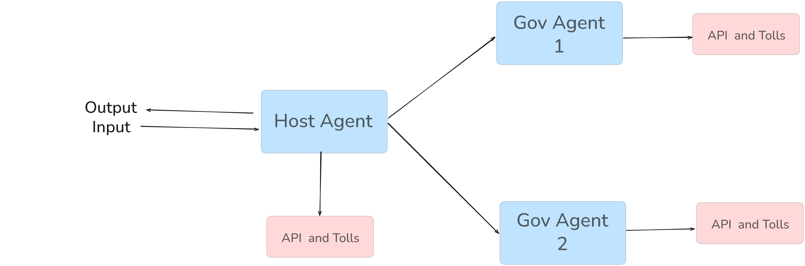

# 🏛️ GovPulse - Government Service Digital Agent Platform

**GovPulse** is an intelligent multi-agent system designed to streamline access to Sri Lankan government services through AI-powered digital assistants. Built using Google's Agent-to-Agent Protocol (A2A), this platform enables seamless communication between specialized government service agents.



## 🎯 Project Overview

GovPulse serves as a centralized platform that connects citizens with various government services through intelligent agents. Each agent specializes in specific government domains (CEB, Health, etc.) and can handle complex queries, provide real-time updates, and assist with service requests.

## 🏗️ System Architecture

```
GovPulse/
├── backend/
│   ├── host/                    # Central Host Agent (GovPulse Core)
│   │   ├── host_agent.py        # Main orchestration logic
│   │   ├── remote_agent_connection.py  # Agent communication
│   │   └── server.py           # FastAPI server (Port 11000)
│   │
│   ├── agents/                  # Specialized Government Service Agents
│   │   ├── ceb/                # Ceylon Electricity Board Agent
│   │   │   ├── agent.py        # CEB-specific logic & tools
│   │   │   ├── server.py       # CEB agent server (Port 10010)
│   │   │   └── task_manager.py # Task handling & streaming
│   │   └── health/             # Health Ministry Agent
│   │       ├── agent.py        # Health service logic
│   │       ├── server.py       # Health agent server (Port 10011)
│   │       └── task_manager.py # Health task management
│   │
│   ├── api/                    # External API integrations
│   │   └── ceb_api.py         # Perplexity API for CEB updates
│   │
│   ├── common/                 # Shared infrastructure
│   │   ├── types.py           # A2A protocol types & models
│   │   ├── client/            # A2A client implementation
│   │   ├── server/            # A2A server framework
│   │   └── utils/             # Authentication & caching
│   │
└── images/
    └── agent-arch.png         # System architecture diagram
```

## � Agent Ecosystem

### � Host Agent (GovPulse Core)
- **Role**: Central orchestrator and user interface
- **Technology**: Google Gemini 2.0 Flash + ADK
- **Features**:
  - Task delegation to specialized agents
  - Agent discovery via A2A protocol
  - Multi-agent coordination
  - Session management

### ⚡ CEB Agent (Ceylon Electricity Board)
- **Role**: Handles electricity-related queries and services
- **Technology**: LangGraph + OpenAI GPT-4 + Perplexity API
- **Capabilities**:
  - Power outage information
  - Maintenance schedules
  - Billing inquiries
  - New project updates
  - Real-time CEB updates via Perplexity API

### 🏥 Health Agent (Ministry of Health)
- **Role**: Provides healthcare service information
- **Technology**: LangGraph + OpenAI GPT-4
- **Capabilities**:
  - Hospital information by city
  - Government health services
  - Emergency contact details
  - Healthcare program information

## 🚀 Key Features

### 🔄 Multi-Agent Communication
- **Google A2A Protocol**: Standards-based agent communication
- **Agent Discovery**: Automatic detection of available services
- **Task Routing**: Intelligent delegation to appropriate agents
- **Streaming Support**: Real-time response streaming

### �️ Enterprise-Grade Infrastructure
- **Push Notifications**: Real-time task updates
- **JWT Authentication**: Secure agent communication
- **Error Handling**: Comprehensive error management
- **Session Management**: Stateful conversations

### 🌐 External Integrations
- **Perplexity AI**: Real-time news and updates
- **OpenAI GPT-4**: Advanced language understanding
- **LangChain/LangGraph**: Agent workflow orchestration

## 🛠️ Technology Stack

- **Backend Framework**: FastAPI + Starlette
- **AI/ML**: Google ADK, OpenAI, LangChain, LangGraph
- **Communication**: JSON-RPC 2.0, Server-Sent Events (SSE)
- **Security**: JWT, JWK authentication
- **External APIs**: Perplexity AI for real-time data
- **Containerization**: Docker & Docker Compose

## 📚 Documentation

- **[Docker Deployment Guide](./DOCKER_GUIDE.md)** - Comprehensive Docker setup and deployment
- **[Architecture Overview](#-system-architecture)** - System design and components
- **[API Documentation](#api-documentation)** - Agent communication protocols

## 📦 Installation & Setup

### Prerequisites
- **Docker Desktop** (Recommended) - Easiest setup
- OR **Python 3.10+** for manual installation
- API Keys (OpenAI, Google, Perplexity)

## 🐳 Docker Setup (Recommended)

> 📖 **For comprehensive Docker documentation, see [DOCKER_GUIDE.md](./DOCKER_GUIDE.md)**

### Quick Start with Docker

**1. Clone Repository**
```bash
git clone <repository-url>
cd GovPulse/agent
```

**2. Environment Configuration**
Create a `.env` file in the `agent/` directory:
```env
# AI/ML API Keys
OPEN_API_KEY=your_openai_api_key
GOOGLE_API_KEY=your_google_api_key

# Optional: Advanced Features
LANGSMITH_API_KEY=your_langsmith_key
LANGCHAIN_TRACING_V2=false
LANGSMITH_PROJECT=GovPulse

# Agent Configuration
HOST_AGENT_PORT=11000
CEB_AGENT_PORT=10010
HEALTH_AGENT_PORT=10011
```

**3. Build Docker Images**
```bash
# Windows
.\build.bat

# Linux/Mac
./build.sh
```

**4. Start the Agent System**
```bash
# Windows
.\run.bat

# Linux/Mac
./run.sh
```

**5. Stop the System**
```bash
# Windows
.\stop.bat

# Linux/Mac
./stop.sh
```

### Docker Services Overview

The system creates three containerized agents:

| Agent | Container Name | Port | Image |
|-------|---------------|------|-------|
| Host Agent | `govpulse-host` | 11000 | `govpulse-host:latest` |
| CEB Agent | `govpulse-ceb` | 10010 | `govpulse-ceb:latest` |
| Health Agent | `govpulse-health` | 10011 | `govpulse-health:latest` |

### Docker Management Commands

**Check Container Status:**
```bash
docker-compose ps
```

**View Logs:**
```bash
# All services
docker-compose logs -f

# Specific service
docker-compose logs -f host-agent
docker-compose logs -f ceb-agent
docker-compose logs -f health-agent
```

**Restart Services:**
```bash
docker-compose restart
```

**Rebuild and Start:**
```bash
# Windows
.\build.bat && .\run.bat

# Linux/Mac
./build.sh && ./run.sh
```

**Clean Up (Remove containers and images):**
```bash
docker-compose down --volumes --remove-orphans
docker rmi govpulse-host:latest govpulse-ceb:latest govpulse-health:latest
```

## 🛠️ Manual Python Setup (Alternative)

### 1. Clone Repository
```bash
git clone <repository-url>
cd GovPulse/agent
```

### 2. Create Virtual Environment
```bash
python -m venv venv
source venv/bin/activate  # Linux/Mac
# or
venv\Scripts\activate     # Windows
```

### 3. Install Dependencies
```bash
pip install -r requirements.txt
```

### 4. Environment Configuration
Create a `.env` file in the project root:
```env
# AI/ML API Keys
OPEN_API_KEY=your_openai_api_key
GOOGLE_API_KEY=your_google_api_key

# Optional: Advanced Features
LANGSMITH_API_KEY=your_langsmith_key
LANGCHAIN_TRACING_V2=false
LANGSMITH_PROJECT=GovPulse
```

## 🚀 Running the Platform

### Docker Deployment (Recommended)

```bash
# Start all agents
./run.sh    # Linux/Mac
.\run.bat   # Windows

# The system will be available at:
# - Host Agent: http://localhost:11000
# - CEB Agent: http://localhost:10010  
# - Health Agent: http://localhost:10011
```

### Manual Python Deployment

**1. CEB Agent (Port 10010)**
```bash
cd backend/agents/ceb
python server.py
```

**2. Health Agent (Port 10011)**
```bash
cd backend/agents/health
python server.py
```

**3. Host Agent (Port 11000)**
```bash
cd backend/host
python server.py
```

### Verify Setup
- CEB Agent: http://localhost:10010/.well-known/agent.json
- Health Agent: http://localhost:10011/.well-known/agent.json
- Host Agent: http://localhost:11000

## 🔍 Troubleshooting

> 🔧 **For detailed Docker troubleshooting, see [DOCKER_GUIDE.md - Troubleshooting Section](./DOCKER_GUIDE.md#-troubleshooting)**

### Docker Issues

**1. Container Restart Loops:**
```bash
# Check logs for errors
docker-compose logs ceb-agent
docker-compose logs health-agent
docker-compose logs host-agent
```

**2. Port Conflicts:**
```bash
# Check if ports are in use
netstat -an | findstr "11000\|10010\|10011"  # Windows
lsof -i :11000,10010,10011  # Linux/Mac
```

**3. Build Failures:**
```bash
# Clean build
docker-compose down
docker system prune -f
.\build.bat  # Windows
./build.sh   # Linux/Mac
```

### Common Solutions

**Missing Dependencies:**
- Ensure `jwcrypto` package is in requirements.txt
- Rebuild images after dependency changes

**API Key Issues:**
- Verify `.env` file exists in the `agent/` directory
- Check API key format and validity
- Restart containers after env changes

## 💡 Usage Examples

### Query CEB Services
```
"What's the latest power outage information for Colombo?"
"When is the next scheduled maintenance in my area?"
"How can I pay my electricity bill online?"
```

### Query Health Services
```
"What hospitals are available in Kandy?"
"What health services does the government provide?"
"Emergency health hotline numbers"
```

## 🔧 Development

> 🐳 **For production deployment and advanced Docker configurations, see [DOCKER_GUIDE.md - Production Section](./DOCKER_GUIDE.md#-production-deployment)**

### Docker Architecture

The GovPulse Agent System uses a multi-container Docker architecture:

```yaml
# docker-compose.yml structure
services:
  host-agent:    # Port 11000 - Central orchestrator
  ceb-agent:     # Port 10010 - Electricity services  
  health-agent:  # Port 10011 - Health services
networks:
  govpulse-network: # Internal agent communication
```

**Container Details:**
- **Base Image**: `python:3.11-slim` for all agents
- **Working Directory**: `/app` in each container
- **User**: Non-root user `appuser` (UID 1000) for security
- **Dependencies**: Shared `requirements.txt` across all agents
- **Network**: Custom bridge network for inter-agent communication

### Adding New Agents

**Docker Integration Steps:**

1. **Create Agent Directory**
```bash
mkdir backend/agents/new-agent
```

2. **Create Dockerfile**
```dockerfile
# Dockerfile.new-agent
FROM python:3.11-slim
WORKDIR /app
# ... (follow existing Dockerfile pattern)
```

3. **Update docker-compose.yml**
```yaml
services:
  new-agent:
    build:
      context: .
      dockerfile: Dockerfile.new-agent
    ports:
      - "10012:10012"
    networks:
      - govpulse-network
```

4. **Update Build Scripts**
Add build commands to `build.bat` and `build.sh`

### Local Development with Docker

**Development Workflow:**

1. **Make Code Changes**
2. **Rebuild Specific Service:**
```bash
docker-compose build ceb-agent
docker-compose up -d ceb-agent
```

3. **Test Changes:**
```bash
docker-compose logs -f ceb-agent
```

**Volume Mounting for Development:**
```yaml
# Add to docker-compose.yml for live reloading
volumes:
  - ./backend:/app/backend:ro
```

### API Documentation
- **A2A Protocol**: JSON-RPC 2.0 based communication
- **Agent Cards**: Service discovery via `.well-known/agent.json`
- **Task Management**: Async task handling with streaming support
- **Health Checks**: Built-in container health monitoring

### Container Health Monitoring

Each container includes health checks:
```bash
# Check container health
docker-compose ps

# View health check logs  
docker inspect govpulse-host --format='{{.State.Health.Status}}'
```

### Performance Optimization

**Container Resource Limits:**
```yaml
deploy:
  resources:
    limits:
      memory: 512M
      cpus: '0.5'
    reservations:
      memory: 256M
      cpus: '0.25'
```

**Multi-stage Builds** (for production):
- Build stage: Install dependencies
- Runtime stage: Copy only necessary files
- Reduced image size and attack surface

### Adding New Agents
1. Create agent directory in `backend/agents/`
2. Implement agent class with required tools
3. Create task manager for request handling
4. Set up server with A2A protocol support
5. Register agent with Host Agent

### API Documentation
- **A2A Protocol**: JSON-RPC 2.0 based communication
- **Agent Cards**: Service discovery via `.well-known/agent.json`
- **Task Management**: Async task handling with streaming support

## 🤝 Contributing

This project is part of the TECH-TRIATHLON hackathon, demonstrating innovative government service delivery through AI agents.

**Features to Contribute:**
- Additional government service agents
- Enhanced UI/UX interfaces
- Mobile app integration
- Advanced analytics dashboard

## 📄 License

This project is developed for educational and demonstration purposes as part of the TECH-TRIATHLON hackathon.

---

**GovPulse** - *Bridging Citizens and Government Services Through Intelligent AI Agents* 🏛️✨

